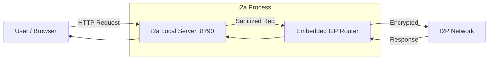

# i2a (I2P to API)


**i2a** is a lightweight, standalone bridge that exposes the Invisible Internet Project (I2P) network as a standard local HTTP API. 

It **embeds** the full [Emissary](https://github.com/altonen/emissary) I2P router, meaning you only need a single binary to get started. It handles the complex lifecycle of the router and creates a clean reverse proxy, allowing standard tools (browsers, Postman, curl, or your own apps) to interact with hidden services effortlessly.

## 🚀 Features

*   **Zero Config**: Launches and manages the underlying I2P router automatically (Embedded).
*   **Single Binary**: No external dependencies or separate router binaries needed.
*   **Port Mapping**: Maps any `.i2p` hidden service to `localhost:8790` (or your chosen port).
*   **Hardened**: Strips sensitive headers before forwarding to the anonymous network.
*   **Cross-Platform**: Runs natively on Windows, Linux, and macOS (Intel & Apple Silicon).

## 📦 Installation

### Automatic (Recommended)

**Linux / macOS**
```bash
curl -fsSL https://raw.githubusercontent.com/BlackTechX011/i2a/main/scripts/install.sh | bash
```

**Windows (PowerShell)**
```powershell
iwr -useb https://raw.githubusercontent.com/BlackTechX011/i2a/main/scripts/install.ps1 | iex
```

### Manual
1. Go to the [Releases Page](https://github.com/BlackTechX011/i2a/releases).
2. Download the binary for your platform.
3. Run it!

### Build from Source
```bash
git clone https://github.com/BlackTechX011/i2a.git
cd i2a/i2a
cargo build --release
```

## 🛠 Usage

By default, **i2a** targets `i2p-projekt.i2p` and hosts it on port `8790`.

```bash
# Start the bridge
i2a
```

### Custom Configurations

**Target a specific hidden service:**
```bash
i2a --target http://myhiddenwebsite.i2p
```

**Change the local hosting port:**
```bash
i2a --port 3000
```

**Full Help Menu:**
```bash
i2a --help
```

## 🏗 Architecture



## ⚠️ Disclaimer
This tool is for educational purposes and facilitating access to the I2P network. The author is not responsible for the content accessed via the I2P network.

## 📄 License
MIT License.