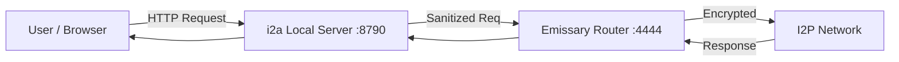

# i2a (I2P to API)


**i2a** is a lightweight, standalone bridge that exposes the Invisible Internet Project (I2P) network as a standard local HTTP API. 

It handles the complex lifecycle of the I2P router (Emissary) and creates a clean reverse proxy, allowing standard tools (browsers, Postman, curl, or your own apps) to interact with hidden services without complex proxy configuration.

## 🚀 Features

*   **Zero Config**: Launches and manages the underlying I2P router automatically.
*   **Single Binary**: Compiles to a standard Windows EXE.
*   **Port Mapping**: Maps any `.i2p` hidden service to `localhost:8790` (or your chosen port).
*   **Hardened**: Strips sensitive headers before forwarding to the anonymous network.
*   **CLI Powered**: Fully customizable via command line arguments.

## 📦 Installation

### Option 1: The "Two-File" Deployment (Recommended)
1. Download the latest `i2a.exe` from Releases.
2. Download `emissary-cli.exe` from the [Official Emissary Repo](https://github.com/altonen/emissary/releases/).
3. Place both in the same folder.
4. Run `i2a.exe`.

### Option 2: Build from Source
```bash
git clone https://github.com/BlackTechX011/i2a.git
cd i2a
cargo build --release
```

## 🛠 Usage

By default, **i2a** targets `i2p-projekt.i2p` and hosts it on port `8790`.

```powershell
./i2a.exe
```

### Custom Configurations

**Target a specific hidden service:**
```powershell
./i2a.exe --target http://myhiddenwebsite.i2p
```

**Change the local hosting port:**
```powershell
./i2a.exe --port 3000
```

**Full Help Menu:**
```powershell
./i2a.exe --help
```

## 🏗 Architecture



## ⚠️ Disclaimer
This tool is for educational purposes and facilitating access to the I2P network. The author is not responsible for the content accessed via the I2P network. Ensure you have the `emissary-cli.exe` binary, as this tool acts as a wrapper and bridge for it.

## 📄 License
MIT License.
